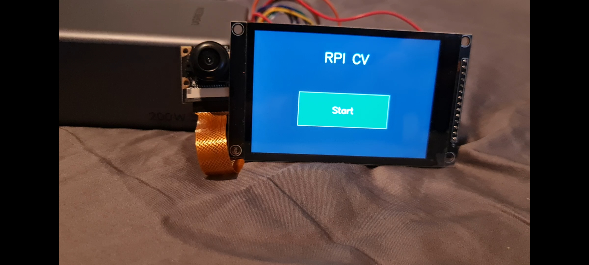
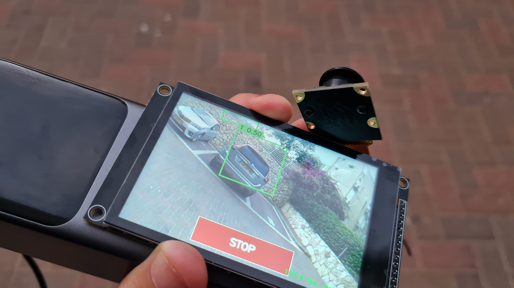
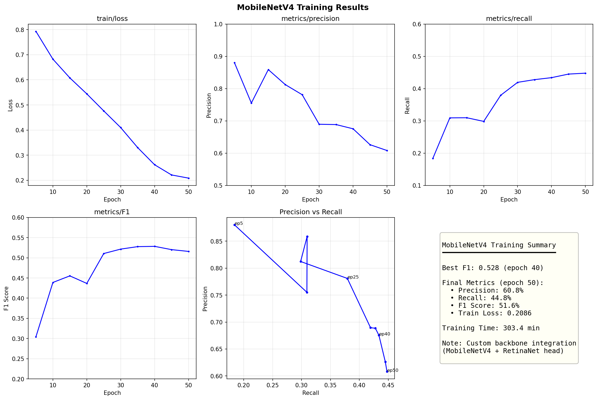
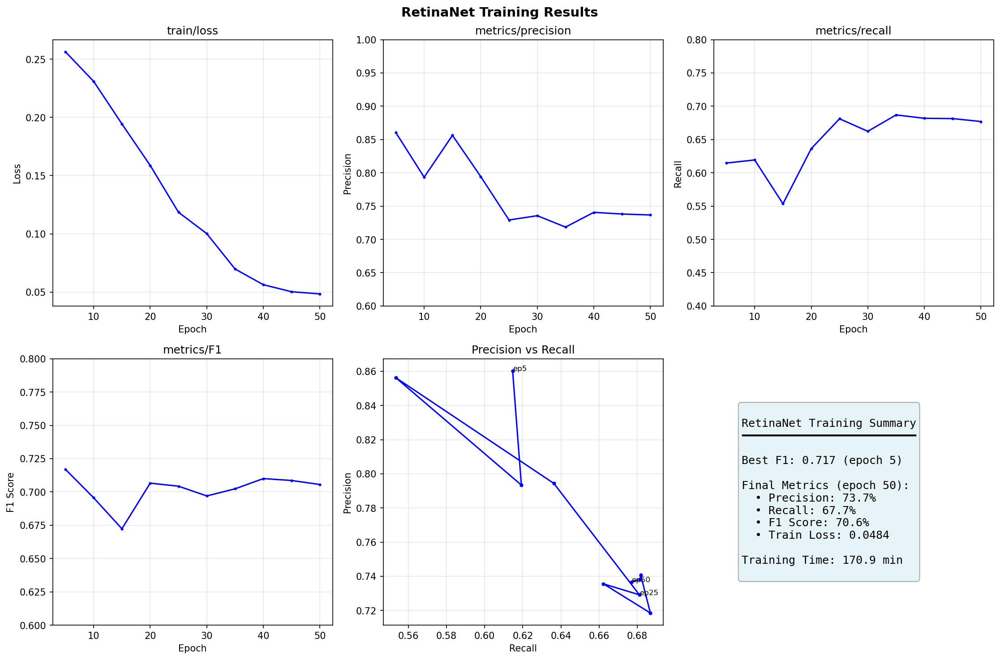
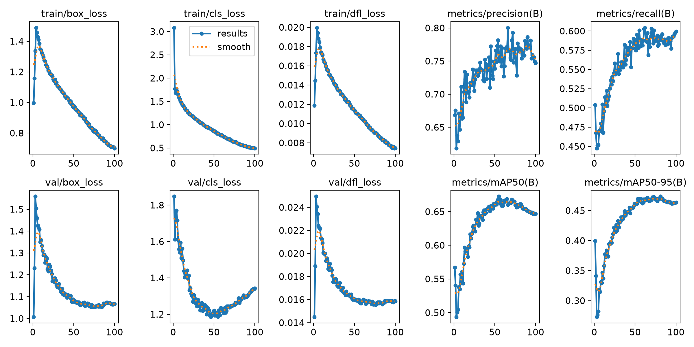
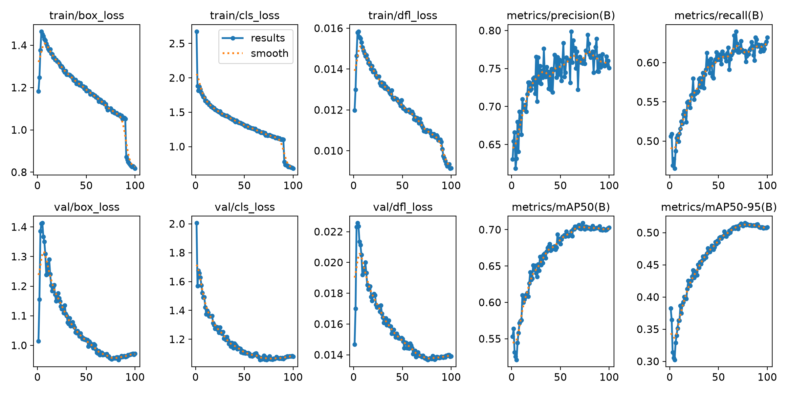
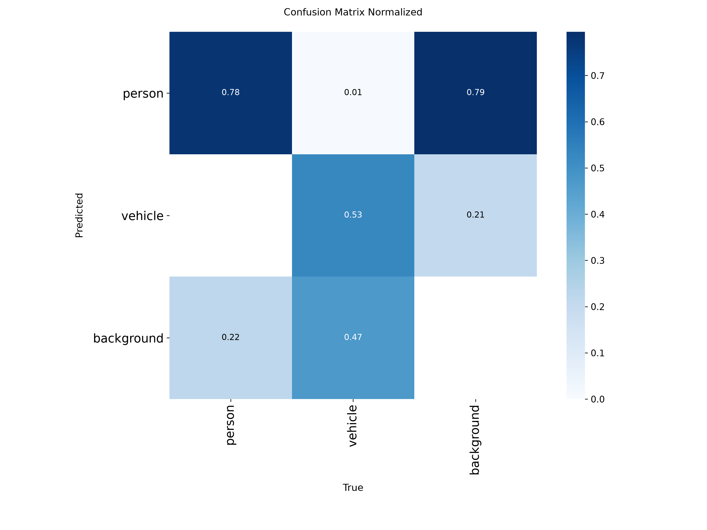

# CV Final Project: Semi-Supervised Auto-Labeling and Edge-Deployable Model Training
Students: 
- Omer Moshe Attia 
- Gavriel Levit

**TL;DR:** Filtered Flickr30k by captions (31K → 10K images with persons/vehicles), auto-labeled with SAM3, validated labels with TTA, then trained edge-deployable detectors.\
**Detector candidates trained:** YOLO26n, YOLO26s, MobileNetV4, RetinaNet 

> edgecv directory contains the functions and service implementation for the edge device (in our case an RPI02W). Images at the end of the readme showing the edge device.

### Quick Demo
```bash
# Run detection with defaults (uses sample image + YOLO26n)
python scripts/demo.py

# Custom image
python scripts/demo.py --image path/to/your/image.jpg

# Different model (yolo26n, yolo26s, retinanet)
python scripts/demo.py --image photo.jpg --model retinanet

# Result saved to outputs/demo_result.jpg
```

---

## Part 0
#### Download:
- [SAM3](https://huggingface.co/facebook/sam3) 
- [flickr](https://www.kaggle.com/datasets/hsankesara/flickr-image-dataset)
- [Persons & Cars](https://app.roboflow.com/binaproj/persons-and-cars-hr4qd/browse)
- Make sure you have what is in the requirements.txt

---

## Part 1 - Creating the Training Dataset

### Architecture

The dataset-creation pipeline first filters Flickr30k by captions to select ~10,000 images likely to contain persons or vehicles. These filtered images are then run through auto-labelers SAM 3 and Florence-2, and the outputs are validated against each other. Furthermore, SAM and Florence are required to label some already labeled images and they will be checked against this ground truth. Another way we checked the auto labelers is TTA where we used augmentations to calculate the confidence we should have in the label and filtering out noise and inconsistent labels. Lastly, we did a sanity check where we saw if training a model on a small subset with many epochs will overfit (checking the data is learnable)

<details>
<summary>Phase 1 diagram</summary>

```
┌─────────────────────────────────────────────────────────────────────────────┐
│                         AUTO-LABELING PIPELINE (Phase 1)                    │
└─────────────────────────────────────────────────────────────────────────────┘

     ┌─────────────────┐              ┌─────────────────┐
     │   Flickr30k     │              │  Roboflow GT    │
     │  (31K images)   │              │  (2,057 images) │
     │  Unlabeled      │              │  Human-labeled  │
     └────────┬────────┘              └────────┬────────┘
              │                                │
              ▼                                │
     ┌─────────────────┐                       │
     │ Caption Filter  │                       │
     │ (person/vehicle │                       │
     │   keywords)     │                       │
     └────────┬────────┘                       │
              │                                │
              ▼                                │
     ┌─────────────────┐                       │
     │ Filtered Flickr │                       │
     │  (9,934 images) │                       │
     └────────┬────────┘                       │
              │                                │
              ▼                                ▼
     ┌─────────────────────────────────────────────────────┐
     │              AUTO-LABELING MODELS                   │
     │  ┌───────────────┐      ┌───────────────────┐       │
     │  │    SAM 3      │      │   Florence-2      │       │
     │  │  (Ultralytics)│      │   (HuggingFace)   │       │
     │  │               │      │                   │       │
     │  │ Text-prompted │      │ Object Detection  │       │
     │  │ Segmentation  │      │ + Phrase Grounding│       │
     │  └───────┬───────┘      └─────────┬─────────┘       │
     └──────────┼────────────────────────┼─────────────────┘
                │                        │
                ▼                        ▼
     ┌─────────────────────────────────────────────────────┐
     │              EVALUATION & COMPARISON                │
     │                                                     │
     │  ┌─────────────┐  ┌─────────────┐  ┌─────────────┐  │
     │  │ Cross-Model │  │Ground Truth │  │   Sanity    │  │
     │  │ Comparison  │  │ Evaluation  │  │   Check     │  │
     │  │   (IoU)     │  │   (mAP)     │  │  Training   │  │
     │  └─────────────┘  └─────────────┘  └─────────────┘  │
     │                                                     │
     │  ┌─────────────┐  ┌─────────────┐  ┌─────────────┐  │
     │  │   Manual    │  │  Ensemble   │  │     TTA     │  │
     │  │ Inspection  │  │    (WBF)    │  │ Consistency │  │
     │  └─────────────┘  └─────────────┘  └─────────────┘  │
     └──────────────────────┬──────────────────────────────┘
                            │
                            ▼
     ┌─────────────────────────────────────────────────────┐
     │              FINAL DATASET (SAM 3)                  │
     │                                                     │
     │        9,380 labeled images (YOLO format)           │
     │        44,274 total detections                      │
     │        Person: 36,214  |  Vehicle: 8,060            │
     └─────────────────────────────────────────────────────┘
```

</details>

---

### Dataset Filtering - Caption-Based Pre-Selection

Before running the auto-labelers, we filtered Flickr30k to select only images likely to contain persons or vehicles. Running SAM/Florence on all 31,000 images would waste compute on landscapes, food, and other irrelevant content.

**Method:** Parse the Flickr30k captions CSV and search for keyword matches.

| Category | Keywords |
|----------|----------|
| **Person** | man, woman, person, child, elder, worker, workers, men, women, baby, infant, kid, kids, guy, girl, boy, female, male, people, pedestrian |
| **Vehicle** | car, truck, motorcycle, bike, scooter, van, jeep, moped, tractor, bus, semitrailer, vehicle, automobile, motorbike, bicycle, taxi, cab, suv, pickup |

**Selection Strategy:** Balanced sampling to address vehicle scarcity
1. Take ALL images with vehicle keywords (vehicles are rare - only ~10% of matches)
2. Add person-only images at a 3:1 ratio to vehicles
3. Include 7% negative images (no keyword matches) to teach the model what's NOT a detection

**Filtering Results:**

| Category | Count |
|----------|-------|
| Both (person + vehicle) | 2,869 |
| Person only | 6,212 |
| Vehicle only | 158 |
| Negative samples | 695 |
| **Total filtered** | **9,934** |


This reduced 31,000 images to ~10,000 relevant candidates before auto-labeling.

---

<details>
<summary>Decisions and Rationale for hyper parameters</summary>

### Decisions and Rationale for hyper parameters

| Parameter | Value | Rationale                                                                                                                                                                                        |
|---|---|--------------------------------------------------------------------------------------------------------------------------------------------------------------------------------------------------|
| **Confidence threshold** | 0.30 | Lower thresholds could drown the labels in noise; higher thresholds could lose too many real detections in busy scenes. 0.30 sits in a sweetspot of the precision/recall curve for both classes. |
| **Min box size** | 1% of image area | Detections below 1% area are probably noise or objects too small for detector to learn from at typical training resolution.                                                                      |
| **Max box size** | 95% of image area | Boxes covering the entire image are probably false positives. 95% lets a legitimate close-up portrait through but blocks out any full screen hallucinations.                                     |
| **NMS IoU** | 0.50 | Industry-standard. Anything lower drops legitimately overlapping objects (a group of people standing close) and anything higher leaves duplicates from multiple overlapping detections.          |
| **Image size** | Original | Detection prompts would work better at native resolution. small people could be lost in crowded scenes and get washed out under aggressive downscaling. |

</details>

---

### Evaluation Methodology

The auto-labeler was selected by running the candidates through five complementary evaluations rather than relying on a single number:

- **Cross-model agreement & ensemble** - Run both SAM and Florence over the same Flickr images, compare detections with IoU matching, and combine via Weighted Box Fusion (WBF). High agreement is a positive signal, while disagreements help identify erratic behavior (like Florence over-tagging vehicles). The ensemble shows what both models agree on.
- **Ground-truth evaluation** - Run both models on the Roboflow Persons & Cars dataset (2,057 human-labeled images) and compute precision, recall, mAP@0.5, and mAP@0.5:0.95 against the ground truth.
- **Sanity-check training** - Train YOLO26n for 50 epochs on a 50-image subset labeled by each model. Tests whether labels are learnable (the model can overfit them), but does not test whether the labels are correct.
- **Manual visual inspection** - Side-by-side visualisation of SAM vs Florence outputs on disagreement images. Allows us to catch problematic behavior from both SAM and Florence.
- **TTA validation** - Test-Time Augmentation consistency check: run each labeler on flipped versions of images and verify detections are stable across augmentations.

---

<details>
<summary>Cross-model agreement</summary>

### SAM vs Florence - Detection Counts on Flickr30k (1,000 images)

| Class | SAM 3 | Florence-2 | Δ |
|---|---|---|---|
| Person | **3,272** | 2,805 | +467 (SAM) |
| Vehicle | 520 | **696** | +176 (Florence) |
| **Total** | **3,792** | 3,501 | +291 (SAM) |

#### Cross-Model Agreement

| Metric | Value |
|---|---|
| Matches at IoU > 0.5 | 2,796 |
| Detections only in SAM | 996 |
| Detections only in Florence | 705 |
| **Agreement rate** | **62.2%** |
| Average IoU on matched boxes | 0.868 |

We can see the models agree mostly (2,796 matched detections with IoU > 0.5).
SAM is more conservative compared to Florence.

</details>

---

<details>
<summary>Ground-truth</summary>

### Ground Truth Evaluation

Both auto-labelers were run on the Roboflow Persons & Cars dataset (2,057 human-annotated images) and compared against the actual labels (ground truth).

| Metric | SAM 3 | Florence-2 | Winner |
|---|---|---|---|
| Precision | **18.87%** | 16.34% | SAM (+15%) |
| Recall | 10.38% | **10.76%** | Florence (+4%) |
| F1 score | **13.39%** | 12.97% | SAM (+3%) |
| mAP@0.5 | **9.46%** | 8.62% | SAM (+10%) |
| mAP@0.5:0.95 | **6.82%** | 6.46% | SAM (+6%) |
| True positives | 137 | 142 | Florence |
| False positives | **589** | 727 | SAM (-19%) |
| False negatives | 1,183 | 1,178 | Florence |

The absolute numbers are low for both models but The relative comparison is the meaningful signal: SAM wins on precision, F1, mAP, and false-positive rate; Florence edges SAM only on recall by a small margin.

</details>

---

<details>
<summary>Sanity-Check</summary>

### Sanity-Check Training

A YOLO26n model was trained for 50 epochs on a 50-image subset from each candidate label source. the goal was to test whether the labels are *learnable*, not whether the model is good.

| Metric | SAM | Florence | Ensemble (WBF) |
|---|---|---|---|
| Total train loss | 3.03 | **2.74** | 2.84 |
| Total val loss | 5.67 | 5.96 | **4.79** |
| Train/val gap (overfit ratio) | 1.87× | 2.17× | **1.68×** |
| Precision | 53.5% | 48.0% | **81.1%** |
| Recall | 33.9% | **40.5%** | 32.9% |
| mAP@0.5 | 29.9% | 38.0% | **42.6%** |

#### My Interpretation

Naively we could give a point to florence here, but we know from previous tests that florence has a ton a false positives and is not accurate as we can see in the ensemble's higher percision and low val loss - when we take the agreement between the models and filter florence's hallucinations we reach much better results.\
So a dataset created from florence would be a bit more learnable - but will learn all the wrong things.

</details>

---

<details>
<summary>Manual Inspection</summary>

### Manual Visual Inspection

Visualisations were generated for both labelers (`scripts/visualize_labels.py --view all`) and a sample of disagreement images was inspected by hand. SAM behaved conservatively - fewer detections overall, with occasional misses, but a very low rate of clearly wrong labels. Florence behaved aggressively - way more detections in total, but with a consistent pattern of misidentifying random objects as vehicles, The manual review confirms what the precision and false-positive numbers already suggested: Florence's extra detections come at the cost of label quality. SAM occasionally misses objects, but the detections it does produce are more reliable.

</details>

---

<details>
<summary>TTA</summary>

### TTA - Validating Annotations

Test-Time Augmentation runs the same detection model multiple times on different transformed versions of the same image (horizontal flip, vertical flip). a true object should be detected consistently across augmentations.

The implementation: (1) apply horizontal and vertical flips to each image; (2) run the labeler on each augmented version; (3) project detected boxes back to original coordinates; (4) compare with original labels using IoU matching; (5) classify boxes as "stable" (detected in multiple views) or "unstable" (inconsistent across views).

**Output metrics:**
- **Consistency score**: Average ratio of stable boxes per image
- **Stability rate**: Total stable boxes / total boxes
- **Low-consistency images**: Images where <50% of boxes are stable (flagged for review)

#### TTA Validation Results

TTA validation was performed on a representative sample of 200 images per model. This sample size provides statistical confidence (95% CI ± 3%) while keeping computation tractable - running 3 augmentation passes per image with full model inference.

| Metric | SAM 3 | Florence-2 | Winner |
|---|---|---|---|
| Images validated | 200 | 200 | - |
| Average consistency | **97.2%** | 94.8% | SAM |
| Stability rate | **95.0%** | 91.2% | SAM |
| Low-consistency images | **0** | 3 | SAM |

SAM's detections are highly stable across augmentations - 97.2% of boxes were detected consistently in multiple views, with zero images flagged as low-consistency. Florence showed slightly lower stability (94.8%) with 3 images where less than half of detections were reproducible across augmentations.

</details>

---

<details>
<summary>Ensemble Validation</summary>

### Ensemble Validation

Ensemble validation runs multiple *different* detection models on the same image and treats agreement between them as a proxy for correctness. The motivation is that a single model's failure modes are systematic - Florence's tendency to invent vehicles, for example, will not be reproduced by an independently trained model like SAM. If two architecturally different models both place a box of the same class at the same location, the probability that both made the same wrong guess by coincidence is much lower than the probability that an object actually exists there.

We ran SAM 3 and Florence-2 over the same 1,000 Flickr images and fused their outputs with Weighted Box Fusion (WBF).

The agreement statistics from our SAM + Florence ensemble:

| Metric | Value |
|---|---|
| Total images | 1,000 |
| Boxes both models agreed on | 2,568 |
| Boxes only SAM produced | 871 |
| Boxes only Florence produced | 933 |
| Average per-image agreement score | 61.0% |
| High-agreement images (≥80%) | 309 |
| Low-agreement images (<30%) | 139 |

The ensemble achieved the highest sanity-check metrics of all label sources (mAP@0.5 = 42.6%, precision = 81.1%, lowest validation loss). Despite that, **we report it for completeness only**: the assignment requires selecting a single auto-labeler (SAM 3 or Florence-2), so the ensemble is not the deliverable label source.

</details>

---

### Final Decision: SAM 3

| Criterion | Weight | SAM 3 | Florence-2 | Winner |
|---|---|---|---|---|
| Ground truth mAP | High | 9.46% | 8.62% | SAM |
| Precision | High | 18.87% | 16.34% | SAM |
| False positives | High | 589 | 727 | SAM |
| Manual inspection | High | Reliable | Many hallucinations | SAM |
| TTA consistency | High | 97.2% | 94.8% | SAM |
| Recall | Medium | 10.38% | 10.76% | Florence |
| Vehicle detections | Medium | 520 | 696 | Florence |
| Sanity-check train loss | Low | 3.03 | 2.74 | Florence |
| Sanity-check mAP | Low | 29.9% | 38.0% | Florence |
| **Final score** | | **6** | **3** | **SAM** |

#### Reasoning

**Why SAM 3:**
1. **Higher precision (18.9% vs 16.3%).**
2. **Fewer false positives (589 vs 727 - 23% lower).** Training on SAM is the safer choice.
3. **Better mAP against ground truth (9.46% vs 8.62%).** The single most objective head-to-head measure of label quality.
4. **Manual inspection confirms the quality story** - SAM's failures are misses but Florence's are inventions which is worse.

**Why not Florence-2:**
1. **High false-positive rate** with consistent failure modes (animals labeled as persons, scenes labeled as vehicles).
2. **The sanity-check advantage is misleading** - low training loss is reproducing the labels, not validating them.
3. **Quantity over quality is the wrong tradeoff** for a semi-supervised pipeline; a smaller, cleaner dataset trains a more reliable detector than a larger noisy one.

---

### Conclusion - Part 1

A five-stage evaluation (cross-model comparison, ground-truth metrics, sanity-check training, manual review, TTA validation) identified **SAM 3** as the higher-quality auto-labeler for Person and Vehicle detection on Flickr30k. The final dataset contains **9,380 labeled images** with **44,274 detections** (36,214 persons, 8,060 vehicles) in YOLO format, split 80/10/10 into train/val/test sets.

---

## Part 2 - Training the Edge-Deployable Detector

### Dataset

The final training dataset was generated by running SAM 3 on the filtered Flickr30k images:
- **Total images:** 9,380 (7,504 train / 938 val / 938 test)
- **Total detections:** 44,274 (36,214 persons, 8,060 vehicles)
- **Split:** 80% train / 10% val / 10% test
- **Class imbalance:** ~4.5:1 person-to-vehicle ratio

### Architecture Selection

We trained three architectures:

| Model | Framework | Rationale |
|---|---|---|
| **YOLO26n** | Ultralytics | Smallest YOLO variant, native edge export, our primary deployment target |
| **RetinaNet** | Torchvision | Focal Loss addresses class imbalance; accuracy reference |
| **MobileNetV4** | Torchvision + timm | Advanced work - custom backbone integration |

**Why these three:**
- YOLO26n is the deployment target (2.4M params, TFLite export)
- RetinaNet's Focal Loss is designed for imbalanced datasets like ours (4.5:1)
- MobileNetV4 backbone integration fulfills the assignment's advanced work requirement

**Why not others:**
- Faster R-CNN: two-stage, heavier, no accuracy advantage for two classes
- EfficientDet: requires third framework for marginal gain


### Training Configuration and Results

<details>
<summary>details</summary>


| | YOLO26n       | RetinaNet     | MobileNetV4         |
|---|---------------|---------------|---------------------|
| Pretrained | COCO          | COCO          | ImageNet (backbone) |
| Optimizer | SGD           | SGD           | SGD                 |
| LR | 0.01          | 0.005         | 0.005               |
| Image size | 640           | 384           | 384                 |
| Batch | 32            | 2             | 4                   |
| Epochs | 100           | 50            | 50                  |
| Hardware | RTX 4060m 8GB | RTX 4070 12GB | RTX 4060m 8GB       |

### Results - Baseline (no augmentation)

| Model | Precision | Recall | mAP@0.5 | mAP@0.5:0.95 | F1 | Params |
|---|---|---|---|---|---|---|
| YOLO26n | 71.7% | 55.6% | 59.2% | 41.4% | - | 2.4M |
| RetinaNet | 80.9% | 75.9% | - | - | 78.3% | 36.1M |
| MobileNetV4 | 67.5% | 43.4% | - | - | 52.8% | 8.8M |

### Results - With Augmentation (YOLO26n only)

Augmentations: mosaic, horizontal flip, HSV jitter, scale jitter.

| Model | Precision | Recall | mAP@0.5 | mAP@0.5:0.95 |
|---|---|---|---|---|
| YOLO26n baseline | 71.7% | 55.6% | 59.2% | 41.4% |
| YOLO26n augmented | 75.3% | 59.7% | 65.9% | 47.0% |
| **Improvement** | **+3.6%** | **+4.1%** | **+6.7%** | **+5.6%** |

### Per-Class Performance (YOLO26n augmented)

| Class | Precision | Recall | mAP@0.5 |
|---|---|---|---|
| Person | 81.0% | 64.6% | 74.8% |
| Vehicle | 60.2% | 29.7% | 35.1% |

The 4.5:1 class imbalance shows - vehicle detection is weaker. RetinaNet's Focal Loss significantly improved recall (75.9% vs YOLO's 59.7%), confirming it handles imbalanced data better.

</details>

### Training Insights

1. **Augmentation works.** YOLO26n gained +6.7% mAP@0.5 with standard augmentations.

2. **Focal Loss handles class imbalance.** RetinaNet achieved the highest F1 (78.3%) and recall (75.9%), validating Focal Loss for our 4.5:1 imbalanced dataset.

3. **MobileNetV4 underperformed.** Lower metrics than both YOLO and RetinaNet. The backbone integration worked, but needed more tuning.

4. **YOLO26n is the right choice for edge.** Best accuracy-to-size ratio (2.4M params), native TFLite export. RetinaNet is more accurate but 15× larger (36M params).

### Final Models

**YOLO26n** - exported to TFLite for RPi Zero 2W.

```
best_models/yolo26n_augmentated.tflite
```

**Best Over All** - to be used on a phone or main series rpi.
```
best_models/retinanet_best.pt
```

Used as benchmark
```
best_models/mobilenetv4_best.pt
```

---

## Scripts Reference

<details>
<summary>References</summary>

```bash
# Step 1: Filter Flickr30k by captions (select images with persons/vehicles)
python scripts/filter_by_caption.py --strategy balanced --person-vehicle-ratio 3.0

# Step 2: Auto-labeling on filtered images
python scripts/run_sam_labeling.py --images-dir outputs/filtered_flickr/images
python scripts/run_florence_labeling.py --images-dir outputs/filtered_flickr/images

# Step 3: Prepare train/val/test splits
python scripts/prepare_dataset.py --labels-dir outputs/full_sam_labels/labels \
    --images-dir outputs/filtered_flickr/images --output-dir outputs/datasets/sam_filtered

# TTA validation on existing labels
python scripts/run_tta_validation.py --labeler sam --sample-size 200
python scripts/run_tta_validation.py --labeler florence --sample-size 200

# Ensemble validation (compares SAM vs Florence, outputs WBF combined labels)
python scripts/run_validation.py --method ensemble
python scripts/run_validation.py --method ensemble --output-ensemble --min-agreement 0.5

# Full pipeline (filtering + labeling + comparison + validation + TTA)
python scripts/run_pipeline.py --all

# YOLO training
python scripts/train_yolo.py --data outputs/datasets/sam_filtered/data.yaml --model yolo26n.pt --phase baseline --epochs 100
python scripts/train_yolo.py --data outputs/datasets/sam_filtered/data.yaml --model yolo26n.pt --phase augmented --epochs 100
python scripts/train_yolo.py --data outputs/datasets/sam_filtered/data.yaml --model yolo26s.pt --phase augmented --epochs 100

# Torchvision training
python scripts/train_torchvision.py --data outputs/datasets/sam_filtered/data.yaml --model retinanet --epochs 50 --batch 4 --imgsz 384
python scripts/train_torchvision.py --data outputs/datasets/sam_filtered/data.yaml --model mobilenetv4 --epochs 50 --batch 8 --imgsz 384

# Export to TFLite
yolo export model=path/to/best.pt format=tflite imgsz=640

# Inference
yolo predict model=path/to/best.pt source=path/to/image.jpg
```

</details>

# Appendix

> edgecv home screen


> edgecv car detected


> edgecv scooter detected


> mobilenetv4 results


> retinanet results


> yolo26n base results


> yolo26n aug results


> yolo26n aug confusion matrix normalized

